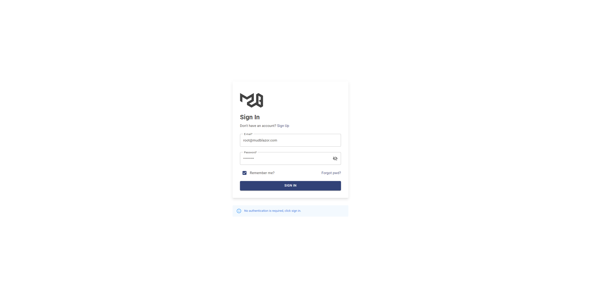

# CleanArchitectureWithBlazorServer
This is a repository for creating a  Blazor Server application following the principles of Clean Architecture
## Live Demo
-  Blazor webassembly mode: https://mudblazor.dotnet6.cn/
-  Blazor Server mode: https://mudblazor-s.dotnet6.cn/
## Screenshots

