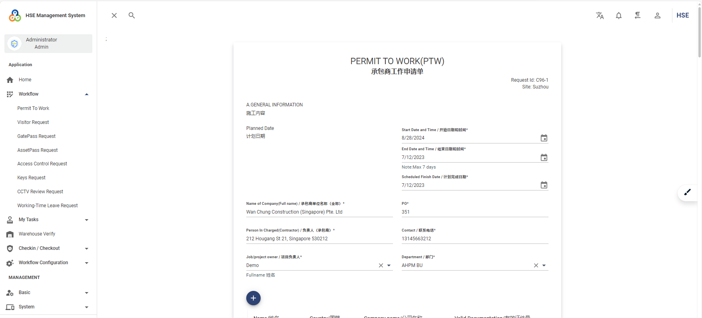
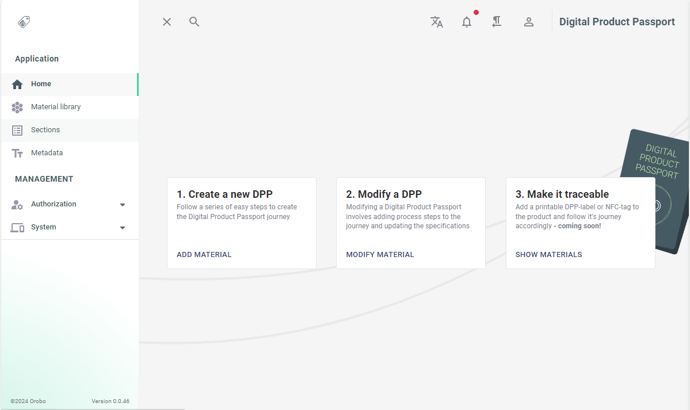

# Clean Architecture Blazor Server

[](https://github.com/neozhu/CleanArchitectureWithBlazorServer/actions/workflows/dotnet.yml)
[](https://github.com/neozhu/CleanArchitectureWithBlazorServer/actions/workflows/codeql-analysis.yml)
[](https://www.nuget.org/packages/CleanArchitecture.Blazor.Solution.Template)
[](https://github.com/neozhu/CleanArchitectureWithBlazorServer/actions/workflows/docker-image.yml)
[](https://www.nuget.org/packages/CleanArchitecture.Blazor.Solution.Template)

> A comprehensive Blazor Server application template built with Clean Architecture principles, featuring advanced code generation, AI-powered development support, and enterprise-grade functionality.

## 🎯 Overview

This project is a production-ready Blazor Server application template that demonstrates Clean Architecture implementation with .NET 9. It provides a solid foundation for building scalable, maintainable enterprise applications with modern development practices and AI-enhanced productivity features.

### Key Features

- **🏗️ Clean Architecture**: Strict layer separation with dependency inversion
- **🎨 Modern UI**: Beautiful, responsive interface built with MudBlazor
- **⚡ Real-time Communication**: SignalR integration for live updates
- **🔐 Enterprise Security**: Multi-factor authentication, role-based access control
- **🌐 Multi-tenancy**: Built-in tenant isolation and management
- **📊 Advanced Data Grid**: Sorting, filtering, pagination, and export capabilities
- **🎨 Code Generation**: Visual Studio extension for rapid development
- **🐳 Docker Ready**: Complete containerization support
- **📱 Progressive Web App**: PWA capabilities for mobile experience

## 🌟 Live Showcase

Experience the application in action:

[](https://www.youtube.com/watch?v=hCsHSNAs-70)

**Live Demo**: [architecture.blazorserver.com](https://architecture.blazorserver.com/)

### Featured Projects Built with This Template

[](https://hse.blazorserver.com/)
**HSE Management System** - [GitHub](https://github.com/neozhu/workflow) | [Live Demo](https://hse.blazorserver.com/)

[](https://materialpassport.blazorserver.com/)
**EU Digital Product Passport** - [Live Demo](https://materialpassport.blazorserver.com/)

## 🛠️ Technology Stack

| Layer | Technologies |
|-------|-------------|
| **Frontend** | Blazor Server, MudBlazor, SignalR |
| **Backend** | .NET 9, ASP.NET Core, MediatR, FluentValidation |
| **Database** | Entity Framework Core, MSSQL/PostgreSQL/SQLite |
| **Authentication** | ASP.NET Core Identity, OAuth 2.0, JWT |
| **Caching** | FusionCache, Redis |
| **Background Jobs** | Hangfire |
| **Testing** | xUnit, FluentAssertions, Moq |
| **DevOps** | Docker, GitHub Actions |

## 🏗️ Architecture Overview

```
┌─────────────────┐    ┌─────────────────┐    ┌─────────────────┐
│   Server.UI     │    │  Application    │    │     Domain      │
│   (Blazor)      │───▶│   (Business)    │───▶│   (Entities)    │
└─────────────────┘    └─────────────────┘    └─────────────────┘
         │                        │                        
         │              ┌─────────────────┐               
         └─────────────▶│ Infrastructure  │               
                        │   (Data/IO)     │               
                        └─────────────────┘               
```

### Layer Responsibilities

- **Domain**: Core business entities and rules (no dependencies)
- **Application**: Business logic, interfaces, and DTOs
- **Infrastructure**: External concerns (database, email, file system)
- **Server.UI**: Blazor components and user interface

 
### 📋 Development Workflow

The project includes a comprehensive [Development Workflow](docs/) with:

- **Task Management**: Structured approach to feature development
- **Code Review Guidelines**: Quality assurance processes
- **Testing Strategies**: Unit and integration testing patterns
- **Deployment Procedures**: CI/CD pipeline configurations

## 🚀 Quick Start

### Prerequisites

- [.NET 9 SDK](https://dotnet.microsoft.com/download/dotnet/9.0)
- [Visual Studio 2022](https://visualstudio.microsoft.com/) or [Rider](https://www.jetbrains.com/rider/)
- [Docker Desktop](https://www.docker.com/) (optional)

### Installation

1. **Install the Template**
   ```bash
   dotnet new install CleanArchitecture.Blazor.Solution.Template
   ```

2. **Create New Project**
   ```bash
   dotnet new ca-blazorserver-sln -n YourProjectName
   cd YourProjectName
   ```

3. **Setup Database**
   ```bash
   dotnet ef database update --project src/Migrators/Migrators.MSSQL
   ```

4. **Run the Application**
   ```bash
   dotnet run --project src/Server.UI
   ```

5. **Access the Application**
   - Navigate to `https://localhost:7152`
   - Login with default credentials (see documentation)

### 🐳 Docker Deployment

**Quick Start with In-Memory Database**:
```bash
docker run -p 8443:443 -e UseInMemoryDatabase=true \
  blazordevlab/cleanarchitectureblazorserver:latest
```

**Production Setup**:
```bash
docker-compose up -d
```

See [Docker Setup Documentation](#docker-setup-for-blazor-server-application) for detailed configuration.

## 📚 Documentation

- **[Architecture Guide](docs/)**: Detailed architecture explanation
- **[Development Workflow](docs/)**: Step-by-step development process
- **[API Documentation](docs/)**: Complete API reference
- **[Deployment Guide](docs/)**: Production deployment instructions
- **[Contributing Guidelines](CONTRIBUTING.md)**: How to contribute to the project

## 📐 Using OpenSpec for Feature Development

OpenSpec enables spec-driven, reviewable changes with clear proposals, deltas, and tasks. This repo includes guidance in `openspec/AGENTS.md` and a project context in `openspec/project.md`.

- Read the quickstart: `openspec/AGENTS.md`
- Project conventions and patterns: `openspec/project.md` (see “New Entity/Feature Guide (Contacts Pattern)”) 

### Workflow

1) Plan a change
- Review specs and pending changes
  - `openspec list --specs`
  - `openspec list`
- Pick a unique, verb-led change id (e.g., `add-customer-management`).

2) Create the change folder and docs
- Create: `openspec/changes/<change-id>/`
- Add files:
  - `proposal.md` – Why, What Changes, Impact
  - `tasks.md` – Implementation checklist
  - Optional `design.md` – Architecture decisions when needed
  - Spec deltas: `openspec/changes/<change-id>/specs/<capability>/spec.md`
- Spec delta format must include sections like:
  - `## ADDED|MODIFIED|REMOVED Requirements`
  - At least one `#### Scenario:` per requirement (use the exact header text)

3) Validate and iterate
- `openspec validate <change-id> --strict`
- Fix any issues before requesting review/approval.

4) Implement after approval
- Follow the tasks in `tasks.md` sequentially and mark them complete.
- Use the patterns in `openspec/project.md`:
  - For data access in handlers use `IApplicationDbContextFactory` and per-operation context lifetime:
    - `await using var db = await _dbContextFactory.CreateAsync(cancellationToken);`
  - Follow MediatR pipeline behaviors, caching tags, and specification patterns.
  - Mirror the Contacts module for a new entity’s DTOs, commands, queries, specs, security, and UI pages/components.

5) Archive after deployment
- Move `openspec/changes/<id>/` to `openspec/changes/archive/YYYY-MM-DD-<id>/` (or use the CLI archive helper if available).
- Re-run `openspec validate --strict`.

### Example change scaffold

- Change id: `add-customer-management`
- Files:
  - `openspec/changes/add-customer-management/proposal.md`
  - `openspec/changes/add-customer-management/tasks.md`
  - `openspec/changes/add-customer-management/specs/customers/spec.md`

`proposal.md` skeleton:

```
## Why
Introduce Customer management to track client records.

## What Changes
- Add Customer entity, CRUD flows, and pages
- Add permissions and navigation

## Impact
- Affected specs: customers
- Affected code: Domain, Application (Contacts-like), Infrastructure, Server.UI
```

`tasks.md` sample:

```
## 1. Implementation
- [ ] 1.1 Domain entity + events
- [ ] 1.2 EF configuration + seeding
- [ ] 1.3 Application commands/queries/specs/security/caching
- [ ] 1.4 UI pages + dialog
- [ ] 1.5 Tests (unit/integration)
```

Spec delta snippet:

```
## ADDED Requirements
### Requirement: Manage Customers
The system SHALL allow users to create, edit, view, list, and delete customers with proper authorization.

#### Scenario: Create customer
- **WHEN** a user submits a valid form
- **THEN** the system saves the customer and returns an id
```

Tips
- Use Contacts as the reference implementation for structure and conventions.
- Add menu entries in `src/Server.UI/Services/Navigation/MenuService.cs`.
- Define permissions under `Permissions.<Module>` and they’ll be picked up during seeding.

## 🔧 Code Generation

Accelerate development with the Visual Studio extension:

- **[CleanArchitecture CodeGenerator](https://github.com/neozhu/CleanArchitectureCodeGenerator)**
- Automatically generates layers for new entities
- Maintains architectural consistency
- Reduces boilerplate code by 80%

<div><video controls src="https://user-images.githubusercontent.com/1549611/197116874-f28414ca-7fc1-463a-b887-0754a5bb3e01.mp4" muted="false"></video></div>

## 🗄️ Database Support

| Database | Provider Name | Status |
|----------|---------------|---------|
| SQL Server | `mssql` | ✅ Fully Supported |
| PostgreSQL | `postgresql` | ✅ Fully Supported |
| SQLite | `sqlite` | ✅ Fully Supported |

Configure in `appsettings.json`:
```json
{
  "DatabaseSettings": {
    "DBProvider": "mssql",
    "ConnectionString": "Server=localhost;Database=YourDb;Trusted_Connection=true;"
  }
}
```

## 🔐 Authentication Providers

Configure OAuth providers in `appsettings.json`:

- **Microsoft**: [Setup Guide](https://learn.microsoft.com/en-us/aspnet/core/security/authentication/social/microsoft-logins)
- **Google**: [Setup Guide](https://learn.microsoft.com/en-us/aspnet/core/security/authentication/social/google-logins)
- **Facebook**: [Setup Guide](https://learn.microsoft.com/en-us/aspnet/core/security/authentication/social/facebook-logins)
- **Twitter**: [Setup Guide](https://learn.microsoft.com/en-us/aspnet/core/security/authentication/social/twitter-logins)

## 🚀 Docker Setup for Blazor Server Application

### Pull the Docker Image

```bash
docker pull blazordevlab/cleanarchitectureblazorserver:latest
```

### Run the Docker Container

For Development (In-Memory Database):
```bash
docker run -p 8443:443 -e UseInMemoryDatabase=true -e ASPNETCORE_ENVIRONMENT=Development -e ASPNETCORE_HTTPS_PORTS=443 blazordevlab/cleanarchitectureblazorserver:latest
```

For Production (Persistent Database and SMTP Configuration):
```bash
docker run -d -p 8443:443 \
-e UseInMemoryDatabase=false \
-e ASPNETCORE_ENVIRONMENT=Development \
-e ASPNETCORE_HTTP_PORTS=80 \
-e ASPNETCORE_HTTPS_PORTS=443 \
-e DatabaseSettings__DBProvider=mssql \
-e DatabaseSettings__ConnectionString="Server=127.0.0.1;Database=BlazorDashboardDb;User Id=sa;Password=<YourPassword>;MultipleActiveResultSets=true;Encrypt=false;TrustServerCertificate=false" \
-e SmtpClientOptions__User=<YourSMTPUser> \
-e SmtpClientOptions__Port=25 \
-e SmtpClientOptions__Server=<YourSMTPServer> \
-e SmtpClientOptions__Password=<YourSMTPPassword> \
-e Authentication__Microsoft__ClientId=<YourMicrosoftClientId> \
-e Authentication__Microsoft__ClientSecret=<YourMicrosoftClientSecret> \
-e Authentication__Google__ClientId=<YourGoogleClientId> \
-e Authentication__Google__ClientSecret=<YourGoogleClientSecret> \
-e Authentication__Facebook__AppId=<YourFacebookAppId> \
-e Authentication__Facebook__AppSecret=<YourFacebookAppSecret> \
blazordevlab/cleanarchitectureblazorserver:latest
```

### Docker Compose Setup

For easier management, use a docker-compose.yml file:

```yaml
version: '3.8'
services:
  blazorserverapp:
    image: blazordevlab/cleanarchitectureblazorserver:latest
    environment:
      - UseInMemoryDatabase=false
      - ASPNETCORE_ENVIRONMENT=Development
      - ASPNETCORE_URLS=http://+:80;https://+:443
      - ASPNETCORE_HTTP_PORTS=80
      - ASPNETCORE_HTTPS_PORTS=443
      - DatabaseSettings__DBProvider=mssql
      - DatabaseSettings__ConnectionString=Server=127.0.0.1;Database=BlazorDashboardDb;User Id=sa;Password=***;MultipleActiveResultSets=true;Encrypt=false;TrustServerCertificate=false
      - SmtpClientOptions__User=<YourSMTPUser>
      - SmtpClientOptions__Port=25
      - SmtpClientOptions__Server=<YourSMTPServer>
      - SmtpClientOptions__Password=<YourSMTPPassword>
      - Authentication__Microsoft__ClientId=<YourMicrosoftClientId>
      - Authentication__Microsoft__ClientSecret=<YourMicrosoftClientSecret>
      - Authentication__Google__ClientId=<YourGoogleClientId>
      - Authentication__Google__ClientSecret=<YourGoogleClientSecret>
      - Authentication__Facebook__AppId=<YourFacebookAppId>
      - Authentication__Facebook__AppSecret=<YourFacebookAppSecret>
    ports:
      - "8443:443"
    volumes:
      - files_volume:/app/Files

  mssql:
    image: mcr.microsoft.com/mssql/server:2022-latest
    environment:
      - ACCEPT_EULA=Y
      - SA_PASSWORD=YourStrongPassword!
    ports:
      - "1433:1433"
    volumes:
      - mssql_data:/var/opt/mssql

volumes:
  files_volume:
  mssql_data:
```

## 🤝 Contributing

We welcome contributions! Please see our [Contributing Guidelines](CONTRIBUTING.md) for details.

1. Fork the repository
2. Create a feature branch
3. Make your changes
4. Add tests
5. Submit a pull request

## 📖 Learning Resources

### Video Tutorials

[](https://www.youtube.com/watch?v=X1b4hFLs4vo)
**Tutorial: Adding a Contact Entity**

[](https://www.youtube.com/watch?v=i3p-3I95YqM)
**Tutorial: Removing a Customer Object**

### Related Projects

- **[CleanAspire](https://github.com/neozhu/cleanaspire)**: Blazor WebAssembly version with .NET Aspire
- **[CleanArchitecture CodeGenerator](https://github.com/neozhu/CleanArchitectureCodeGenerator)**: Visual Studio extension

## 🌐 About the Creator

Visit my website for more Blazor resources and professional services:

**[BlazorServer.com](https://blazorserver.com)** - Blazor Development Services & Resources

## ❤️ Support This Project

If this project helps you, please consider supporting its development:

- **⭐ Star this repository**
- **🐛 Report issues**
- **💡 Suggest features**
- **💰 Sponsor**: [GitHub Sponsors](https://github.com/sponsors/neozhu) | [PayPal](https://paypal.me/hualinz)

Your support helps maintain and improve this project. Thank you! 🙏

## 📄 License

This project is licensed under the MIT License - see the [LICENSE](LICENSE) file for details.

---

<div align="center">

**Built with ❤️ using Clean Architecture principles**

[⭐ Star this repo](https://github.com/neozhu/CleanArchitectureWithBlazorServer) | [🐛 Report Bug](https://github.com/neozhu/CleanArchitectureWithBlazorServer/issues) | [💡 Request Feature](https://github.com/neozhu/CleanArchitectureWithBlazorServer/issues)

</div>
