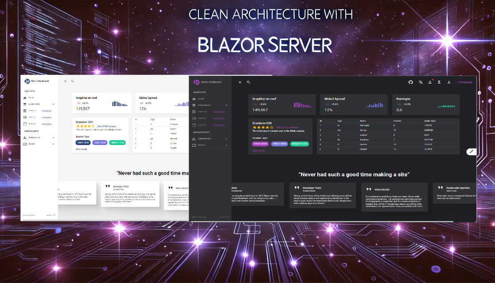
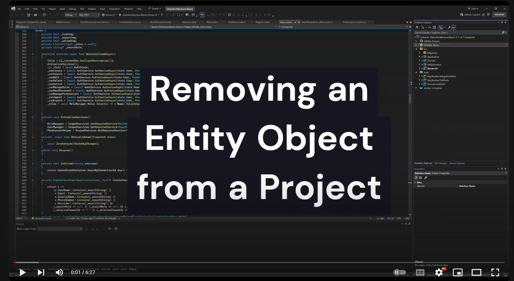
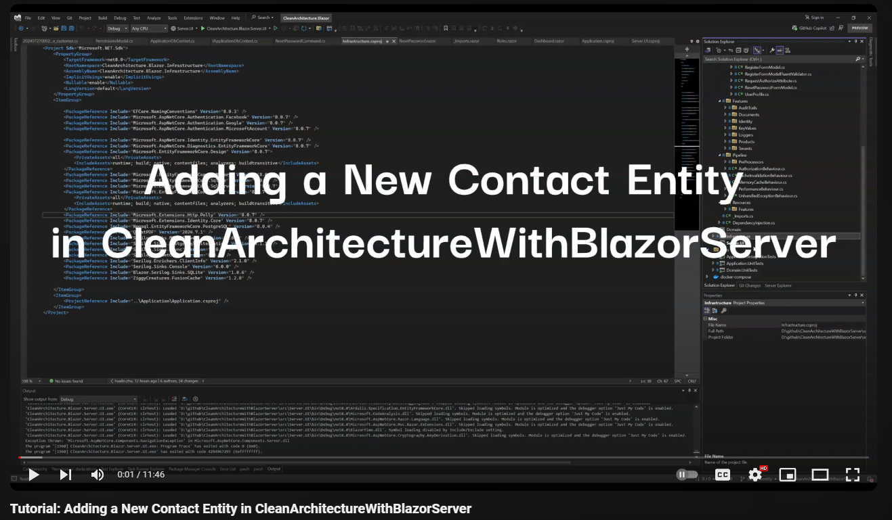

# Clean Architecture With Blazor Server

[](https://github.com/neozhu/CleanArchitectureWithBlazorServer/actions/workflows/dotnet.yml)
[](https://github.com/neozhu/CleanArchitectureWithBlazorServer/actions/workflows/codeql-analysis.yml)
[](https://www.nuget.org/packages/CleanArchitecture.Blazor.Solution.Template)
[](https://github.com/neozhu/CleanArchitectureWithBlazorServer/actions/workflows/docker-image.yml)
[](https://www.nuget.org/packages/CleanArchitecture.Blazor.Solution.Template)

This repository hosts a Blazor Server application designed with Clean Architecture principles, featuring a sophisticated
user interface and an efficient code generator. This setup allows for the swift creation of remarkable web applications
using .NET Blazor technology.

## Explore the Live Demo

Experience the application in action in Blazor Server mode by visiting


- MS SQL Database: [architecture.blazorserver.com](https://architecture.blazorserver.com/)

- PostgreSQL Database: [architecture.blazors.app](https://architecture.blazors.app/)

## Visual Insights

Dive into the application's aesthetics and functionality through screenshots and a video walkthrough.
[](https://www.youtube.com/watch?v=hCsHSNAs-70 "Everything Is AWESOME")

## Development Setup

To get started with development, ensure you have the following tools and environments set up:

- Microsoft Visual Studio Community 2022 (64-bit)
- Docker
- .NET 8.0
- Unit Test

This streamlined overview provides all the essential information about the Blazor Server application's repository, live
demo, visual insights, and required development environment.

## Setup Multiple authentication providers

Use the following topics to configure your application to use the respective providers:

- [Facebook instructions](https://learn.microsoft.com/en-us/aspnet/core/security/authentication/social/facebook-logins?view=aspnetcore-8.0)
- [Twitter instructions](https://learn.microsoft.com/en-us/aspnet/core/security/authentication/social/twitter-logins?view=aspnetcore-8.0)
- [Google instructions](https://learn.microsoft.com/en-us/aspnet/core/security/authentication/social/google-logins?view=aspnetcore-8.0)
- [Microsoft instructions](https://learn.microsoft.com/en-us/aspnet/core/security/authentication/social/microsoft-logins?view=aspnetcore-8.0)
- [Other provider instructions](https://learn.microsoft.com/en-us/aspnet/core/security/authentication/social/other-logins?view=aspnetcore-8.0)

https://learn.microsoft.com/en-us/aspnet/core/security/authentication/social/?view=aspnetcore-8.0&tabs=visual-studio

## Docker Setup for Blazor Server Application

### Pull the Docker Image

First, pull the latest version of the Blazor Server Docker image:

```bash
docker pull blazordevlab/cleanarchitectureblazorserver:latest
```

### Run the Docker Container

You can start the container in two modes: using an in-memory database for development purposes or connecting to an MSSQL
database for persistent storage and configuring SMTP for email functionalities.

For Development (In-Memory Database):

```bash
docker run -p 8443:443 -e UseInMemoryDatabase=true -e ASPNETCORE_ENVIRONMENT=Development -e ASPNETCORE_HTTPS_PORTS=443 blazordevlab/cleanarchitectureblazorserver:latest
```

For Production (Persistent Database and SMTP Configuration):

```bash

docker run -d -p 8443:443 \
-e UseInMemoryDatabase=false \
-e ASPNETCORE_ENVIRONMENT=Development \
-e ASPNETCORE_HTTP_PORTS=80 \
-e ASPNETCORE_HTTPS_PORTS=443 \
-e DatabaseSettings__DBProvider=mssql \
-e DatabaseSettings__ConnectionString="Server=127.0.0.1;Database=BlazorDashboardDb;User Id=sa;Password=<YourPassword>;MultipleActiveResultSets=true;Encrypt=false;TrustServerCertificate=false" \
-e SmtpClientOptions__User=<YourSMTPUser> \
-e SmtpClientOptions__Port=25 \
-e SmtpClientOptions__Server=<YourSMTPServer> \
-e SmtpClientOptions__Password=<YourSMTPPassword> \
-e Authentication__Microsoft__ClientId=<YourMicrosoftClientId> \
-e Authentication__Microsoft__ClientSecret=<YourMicrosoftClientSecret> \
-e Authentication__Google__ClientId=<YourGoogleClientId> \
-e Authentication__Google__ClientSecret=<YourGoogleClientSecret> \
-e Authentication__Facebook__AppId=<YourFacebookAppId> \
-e Authentication__Facebook__AppSecret=<YourFacebookAppSecret> \
blazordevlab/cleanarchitectureblazorserver:latest
```

Replace placeholder values (<Your...>) with your actual configuration details.

### Docker Compose Setup

For easier management, use a docker-compose.yml file:

```yml
version: '3.8'
services:
  blazorserverapp:
    image: blazordevlab/cleanarchitectureblazorserver:latest
    environment:
      - UseInMemoryDatabase=false
      - ASPNETCORE_ENVIRONMENT=Development
      - ASPNETCORE_URLS=http://+:80;https://+:443
      - ASPNETCORE_HTTP_PORTS=80
      - ASPNETCORE_HTTPS_PORTS=443
      - DatabaseSettings__DBProvider=mssql
      - DatabaseSettings__ConnectionString=Server=127.0.0.1;Database=BlazorDashboardDb;User Id=sa;Password=***;MultipleActiveResultSets=true;Encrypt=false;TrustServerCertificate=false
      - SmtpClientOptions__User=<YourSMTPUser>
      - SmtpClientOptions__Port=25
      - SmtpClientOptions__Server=<YourSMTPServer>
      - SmtpClientOptions__Password=<YourSMTPPassword>
      - Authentication__Microsoft__ClientId=<YourMicrosoftClientId>
      - Authentication__Microsoft__ClientSecret=<YourMicrosoftClientSecret>
      - Authentication__Google__ClientId=<YourGoogleClientId>
      - Authentication__Google__ClientSecret=<YourGoogleClientSecret>
      - Authentication__Facebook__AppId=<YourFacebookAppId>
      - Authentication__Facebook__AppSecret=<YourFacebookAppSecret>
    ports:
      - "8443:443"
    volumes:
      - files_volume:/app/Files

volumes:
  files_volume:
```

### Notes:

Replace <Your...> placeholders with actual values from your environment.
The files_volume volume is used for persistent storage of application files. Adjust or extend volumes based on your
specific needs.
This optimized guide should help in setting up your Blazor Server application with either an in-memory or MSSQL
database, configured SMTP server for email functionalities, and OAuth authentication for Microsoft, Google, and
Facebook.

## Supported Databases

* PostgreSQL (Provider Name: `postgresql`)
* Microsoft SQL Server (Provider Name: `mssql`)
* SQLite (Provider Name: `sqlite`)

### How to select a specific Database?

1. Open the `appsettings.json` file located in the src directory of the `Server.UI` project.
2. Change the setting `DBProvider` to the desired provider name (See Supported Databases).
3. Change the `ConnectionString` to a connection string, which works for your selected database provider.

## Docker compose https deployment

- Create self-signed development certificates for the project
  -
  cmd: `dotnet dev-certs https -ep $env:USERPROFILE\.aspnet\https\CleanArchitecture.Blazor.Server.UI.pfx -p Password@123`
    - cmd: `dotnet dev-certs https --trust`
- Manage User secrets to save the password
    - cmd: `dotnet user-secrets init`
    - cmd: `dotnet user-secrets -p Server.UI.csproj set "Kestrel:Certificates:Development:Password" "Password@123"`

## Code Generator Extension for visual studio.net 2022

<div><video controls src="https://user-images.githubusercontent.com/1549611/197116874-f28414ca-7fc1-463a-b887-0754a5bb3e01.mp4" muted="false"></video></div>

### Install CleanArchitecture CodeGenerator For Blazor App

- Open Manage Extensions Search with `CleanArchitecture CodeGenerator For Blaozr App`
  
- Download to Install

### CleanArchitecture CodeGenerator For Blazor App Repo

- https://github.com/neozhu/CleanArchitectureCodeGenerator
- The code generator can automatically generate the standard code
    - Application Layer Code

- 
    - Domain Event

- 
    - Blazor UI Layer Code

- 
    - Task List

- 
    - Test Explorer
- 

## How to install solution templates

- install the project template
    - run CLI: `dotnet new install ./`
    - run CLI: `dotnet new list`


- create a solution with the template
    - run CLI: `dotnet new ca-blazorserver-sln` or `dotnet new ca-blazorserver-sln -n NewProjectName(root namesapces)`


- build a project template with nuget.exe
    - run CLI: `.\nuget.exe add -Source .\ CleanArchitecture.Blazor.Solution.Template.1.0.0-preview.1.nupkg`
      
    - create a new project from Clean Architecture for Blazor Server Solution
      


## Tutorial: Removing an cutomer Object from a Project
[](https://www.youtube.com/watch?v=i3p-3I95YqM "Everything Is AWESOME")


## Tutorial: add an contact Entity in the project
[](https://www.youtube.com/watch?v=X1b4hFLs4vo "Everything Is AWESOME")


## Why I chose Blazor Server

- I hate switching between C# and JavaScript at the same time in order to develop a project, which is why I opted for
  Blazor Server.

## Characteristic
- Real-Time Updates
- Avoid repeating work
- Focus on story implementation
- Integration Hangfire dashboard
- Implementation OCR image recognition
- org chart


https://github.com/neozhu/CleanArchitectureWithBlazorServer/assets/1549611/2b33254c-1022-472b-90c2-b0c0e068494f


  

## About

Coming up.

## License

MIT License
