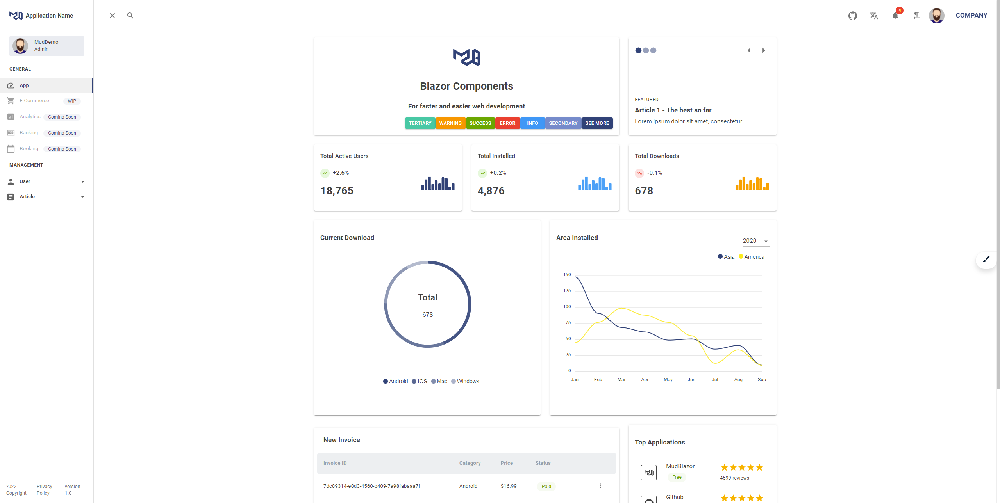

# CleanArchitectureWithBlazorServer
This is a repository for creating a  Blazor Server application following the principles of Clean Architecture
## Live Demo
-  Blazor Server mode: https://mudblazor-s.dotnet6.cn/
## Screenshots and video

## Development Enviroment
- Microsoft Visual Studio Community 2022 (64-bit) 
- Docker
- .NET 6.0
## Code generation
- CleanArchitectureCodeGenerator 
- https://github.com/neozhu/CleanArchitectureCodeGenerator
## Why develop with blazor server mode
- Develop fast
- Runing fast
- Most simple

## Characteristic
- Clean principles
- Simple principles
- Easy to start with

## About
Coming up.

## License
Apache 2.0