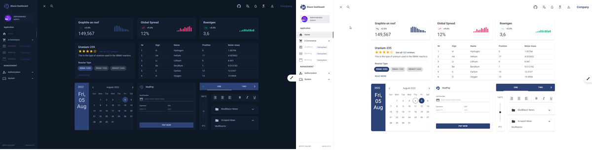
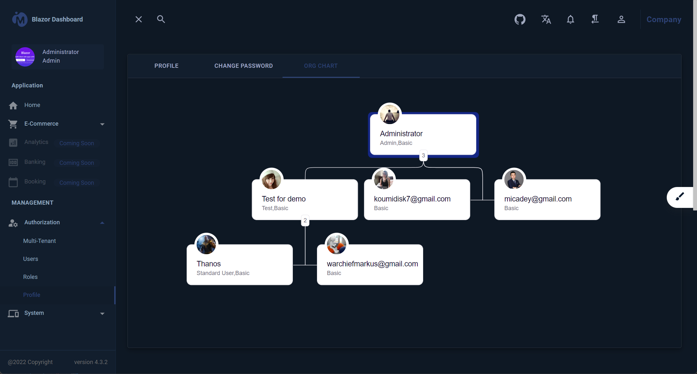

# Clean Architecture With Blazor Server

[](https://github.com/neozhu/CleanArchitectureWithBlazorServer/actions/workflows/dotnet.yml)
[](https://github.com/neozhu/CleanArchitectureWithBlazorServer/actions/workflows/codeql-analysis.yml)
[](https://www.nuget.org/packages/CleanArchitecture.Blazor.Solution.Template)
[](https://github.com/neozhu/CleanArchitectureWithBlazorServer/actions/workflows/docker-image.yml)
[](https://www.nuget.org/packages/CleanArchitecture.Blazor.Solution.Template)

This is a repository for creating a Blazor Server application following the principles of Clean Architecture. It has a
nice user interface, and an efficient code generator that allows you to quickly build amazing web application with .net
Blazor technology.

## Live Demo

- Blazor Server mode:https://architecture.blazorserver.com/

## Screenshots and video

[](https://www.youtube.com/embed/GyZJl_dG-Pg "Everything Is AWESOME")

## Development Environment

- Microsoft Visual Studio Community 2022 (64-bit)
- Docker
- .NET 8.0
- Unit Test

## Docker Container
```bash
# Docker Pull Command
docker pull dockerksjscn/cleanarchitectureblazorserver:latest
```

```bash
# Docker Run
# default container port:8080

# default without database
docker run -p 8080:8080 -e UseInMemoryDatabase=true -e ASPNETCORE_ENVIRONMENT=Development dockerksjscn/cleanarchitectureblazorserver:latest

# set database connection
# set SMPT Server
docker run -d -p 8080:8080 -e UseInMemoryDatabase=false \
-e ASPNETCORE_ENVIRONMENT=Development \
-e DatabaseSettings__DBProvider=mssql \
-e DatabaseSettings__ConnectionString=Server=10.33.1.xxx;Database=BlazorDashboardDb;User Id=sa;Password=***;MultipleActiveResultSets=true;Encrypt=false;TrustServerCertificate=false \
-e SmtpClientOptions__User=*** \
-e SmtpClientOptions__Port=25 \
-e SmtpClientOptions__Server=*** \
-e SmtpClientOptions__Password=*** \
dockerksjscn/cleanarchitectureblazorserver:latest
```
## docker-compose.yml

```bash
version: '3.8'
services:
  blazorserverapp:
    image: dockerksjscn/cleanarchitectureblazorserver:latest
    user: "1000:1000"
    environment:
      - UseInMemoryDatabase=false
      - ASPNETCORE_ENVIRONMENT=Development
      - DatabaseSettings__DBProvider=mssql
      - DatabaseSettings__ConnectionString=Server=10.33.1.xx;Database=BlazorDashboardDb;User Id=sa;Password=***;MultipleActiveResultSets=true;Encrypt=false;TrustServerCertificate=false
      - SmtpClientOptions__User=***
      - SmtpClientOptions__Port=25
      - SmtpClientOptions__Server=***
      - SmtpClientOptions__Password=***
    ports:
      - "8014:8080"
    volumes:
      - files_volume:/app/Files

volumes:
  files_volume:
```

To run a Docker Compose setup as defined in your docker-compose.yaml file and ensure the Docker volume files_volume is accessible with read and write permissions by a user group with the ID 1000, follow these steps:

```bash
# Change Ownership: Use the chown command to change the owner and/or group of the volume directory. If you want the user group with group ID 1000 to own the directory, you can execute the following command:
sudo chown -R :1000 /var/lib/docker/volumes/blazorserverapp_files_volume
# Set Read and Write Permissions: Use the chmod command to change the permissions of files and directories. To grant read and write permissions to the group members, execute:
sudo chmod -R g+rw /var/lib/docker/volumes/blazorserverapp_files_volume
```


## Supported Databases

* PostgreSQL (Provider Name: `postgresql`)
* Microsoft SQL Server (Provider Name: `mssql`)
* SQLite (Provider Name: `sqlite`)

### How to select a specific Database?

1. Open the `appsettings.json` file located in the src directory of the `Server.UI` project.
2. Change the setting `DBProvider` to the desired provider name (See Supported Databases).
3. Change the `ConnectionString` to a connection string, which works for your selected database provider.

## Docker compose https deployment

- Create self-signed development certificates for the project
  -
  cmd: `dotnet dev-certs https -ep $env:USERPROFILE\.aspnet\https\CleanArchitecture.Blazor.Server.UI.pfx -p Password@123`
    - cmd: `dotnet dev-certs https --trust`
- Manage User secrets to save the password
    - cmd: `dotnet user-secrets init`
    - cmd: `dotnet user-secrets -p Server.UI.csproj set "Kestrel:Certificates:Development:Password" "Password@123"`

## Code Generator Extension for visual studio.net 2022

<div><video controls src="https://user-images.githubusercontent.com/1549611/197116874-f28414ca-7fc1-463a-b887-0754a5bb3e01.mp4" muted="false"></video></div>

### Install CleanArchitecture CodeGenerator For Blazor App

- Open Manage Extensions Search with `CleanArchitecture CodeGenerator For Blaozr App`
  
- Download to Install

### CleanArchitecture CodeGenerator For Blazor App Repo

- https://github.com/neozhu/CleanArchitectureCodeGenerator
- The code generator can automatically generate the standard code
    - Application Layer Code

        - 
    - Domain Event

        - 
    - Blazor UI Layer Code

        - 
    - Task List

        - 

## How to install solution templates

- install the project template
    - run CLI: `dotnet new install ./`
    - run CLI: `dotnet new list`


- create a solution with the template
    - run CLI: `dotnet new ca-blazorserver-sln` or `dotnet new ca-blazorserver-sln -n NewProjectName(root namesapces)`


- build a project template with nuget.exe
    - run CLI: `.\nuget.exe add -Source .\ CleanArchitecture.Blazor.Solution.Template.1.0.0-preview.1.nupkg`
      
    - create a new project from Clean Architecture for Blazor Server Solution
      

## Why I chose Blazor Server

- I hate switching between C# and JavaScript at the same time in order to develop a project, which is why I opted for
  Blazor Server.

## Characteristic

- Avoid repeating work
- Focus on story implementation
- Integration Hangfire dashboard
- Implementation OCR image recognition

  
- org chart

  

## About

Coming up.

## License

MIT License
