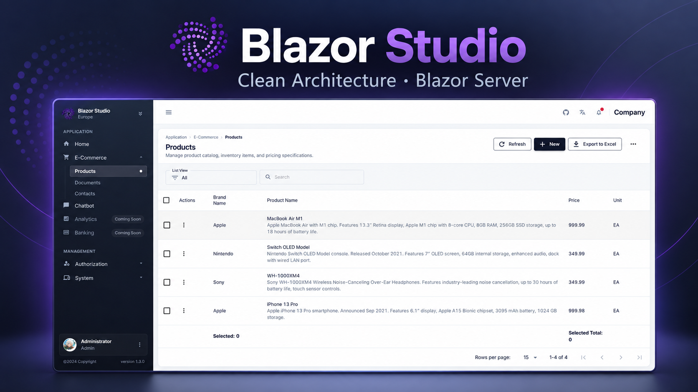
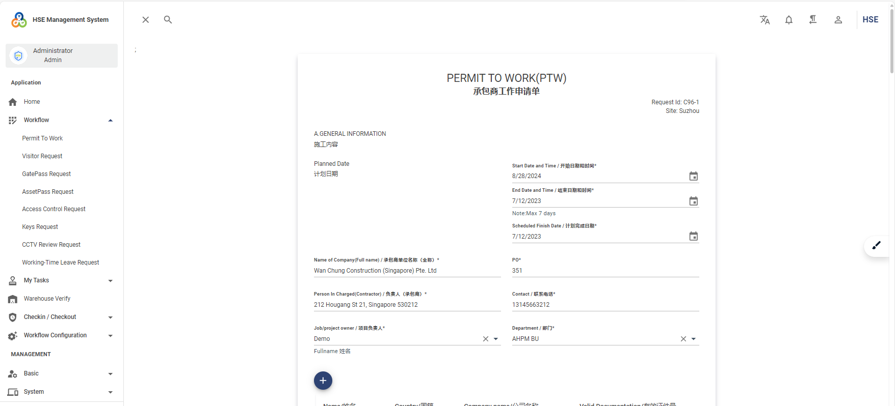
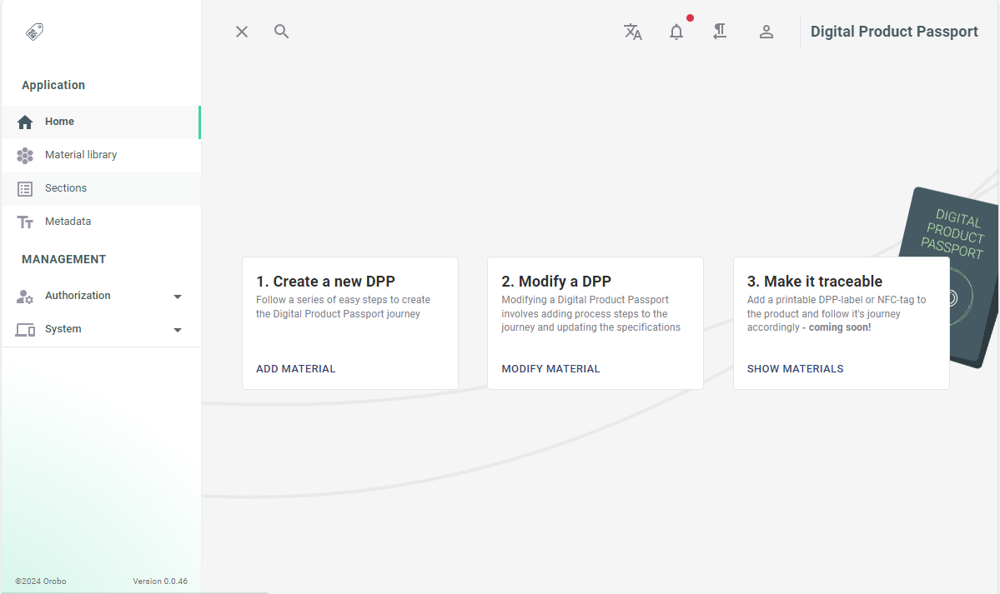
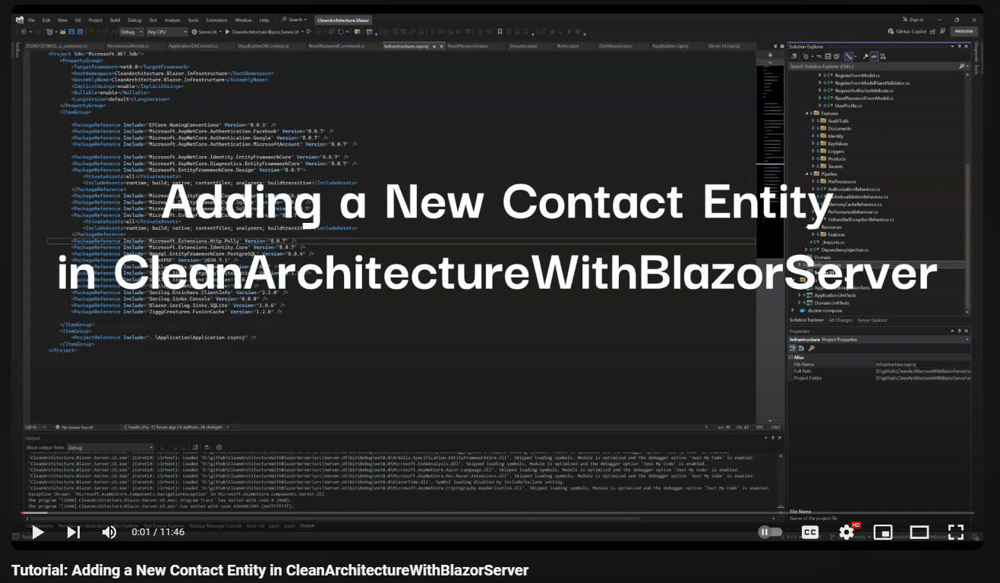
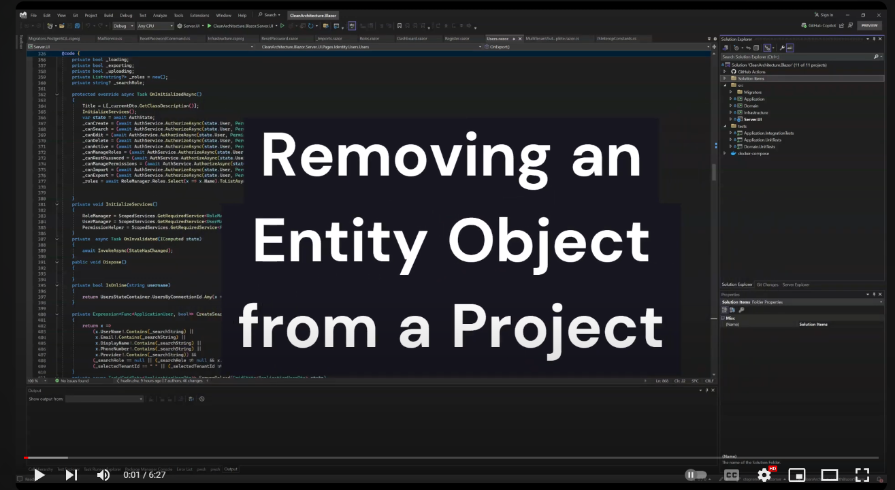

# Clean Architecture Blazor Server Application Template

[](https://github.com/neozhu/CleanBlazorServerPro/actions/workflows/dotnet.yml)
[](https://github.com/neozhu/CleanBlazorServerPro/actions/workflows/codeql-analysis.yml)
[](https://github.com/neozhu/CleanBlazorServerPro/actions/workflows/docker-image.yml)


> A production-ready Blazor Server application template built on Clean Architecture principles, offering advanced code generation, AI-assisted development workflows, and enterprise-grade capabilities for building scalable and maintainable systems.


## 🎯 Overview

This repository provides a **production-grade Blazor Server solution template** designed in strict accordance with **Clean Architecture principles** and modern **enterprise application standards**.

Built on **.NET 10**, the template demonstrates a **well-structured, scalable, and maintainable architecture** for developing complex business systems. It integrates **advanced code generation capabilities**, **AI-assisted development workflows**, and **specification-driven design patterns**, enabling teams to accelerate development while preserving architectural consistency and code quality.

The solution is intended to serve both as a **reference implementation** for Blazor Clean Architecture best practices and as a **ready-to-use foundation** for enterprise-level applications that require long-term maintainability, extensibility, and high development efficiency.


### Key Features

- **🏗️ Clean Architecture**: Strict layer separation with dependency inversion
- **🎨 Modern UI**: Beautiful, responsive interface built with MudBlazor
- **⚡ Real-time Communication**: SignalR integration for live updates
- **🔐 Enterprise Security**: Multi-factor authentication, role-based access control
- **🌐 Multi-tenancy**: Built-in tenant isolation and management
- **📊 Advanced Data Grid**: Sorting, filtering, pagination, and export capabilities
- **🎨 Code Generation**: Visual Studio extension for rapid development
- **🐳 Docker Ready**: Complete containerization support
- **📱 Progressive Web App**: PWA capabilities for mobile experience

## 🌟 Live Showcase

Experience the application in action:

[](https://www.youtube.com/watch?v=hCsHSNAs-70)

**Live Demo**: [architecture.blazorserver.com](https://architecture.blazorserver.com/)

### Featured Projects Built with This Template

[](https://hse.blazorserver.com/)
**HSE Management System** - [GitHub](https://github.com/neozhu/workflow) | [Live Demo](https://hse.blazorserver.com/)

[](https://materialpassport.blazorserver.com/)
**EU Digital Product Passport** - [Live Demo](https://materialpassport.blazorserver.com/)

## 🛠️ Technology Stack

| Layer | Technologies |
|-------|-------------|
| **Frontend** | Blazor Server, MudBlazor, SignalR |
| **Backend** | .NET 10, ASP.NET Core, MediatR, FluentValidation |
| **Database** | Entity Framework Core, MSSQL/PostgreSQL/SQLite |
| **Authentication** | ASP.NET Core Identity, OAuth 2.0, JWT |
| **Caching** | FusionCache, Redis |
| **Background Processing** | Hosted services, in-memory queues |
| **Testing** | xUnit, FluentAssertions, Moq |
| **DevOps** | Docker, GitHub Actions |

## 🏗️ Architecture Overview

```
┌─────────────────┐    ┌─────────────────┐    ┌─────────────────┐
│   Server.UI     │    │  Application    │    │     Domain      │
│   (Blazor)      │───▶│   (Business)    │───▶│   (Entities)    │
└─────────────────┘    └─────────────────┘    └─────────────────┘
         │                        │                        
         │              ┌─────────────────┐               
         └─────────────▶│ Infrastructure  │               
                        │   (Data/IO)     │               
                        └─────────────────┘               
```

### Layer Responsibilities

- **Domain**: Core business entities and rules (no dependencies)
- **Application**: Business logic, interfaces, and DTOs
- **Infrastructure**: External concerns (database, email, file system)
- **Server.UI**: Blazor components and user interface

## 🧩 Dynamic Fields Architecture

The dynamic-fields subsystem adds template-driven attributes to selected business entities without adding entity-specific columns for every custom field. `Product` is the reference implementation, and the same building blocks can be reused by future entities such as `Contract` or `Asset`.

### Model

```text
FieldGroupTemplate
└── FieldSection
    └── FieldSectionItem ──> FieldDefinition
                               (type, label, limits, regex, unit, picklist)

ExtensibleEntity
└── FieldGroupInstance ──> FieldGroupTemplate
    └── FieldValue ──────> FieldDefinition
```

The model separates field metadata from record values:

- `FieldDefinition` describes a reusable field and its validation metadata.
- `FieldGroupTemplate` organizes definitions into ordered sections and determines which fields apply to a business record.
- `FieldGroupInstance` binds one extensible business record to one template.
- `FieldValue` stores one normalized string value for one definition.
- `ExtensibleEntity` exposes the optional `DynamicFields` navigation used by supported business entities.

`ExtensibleEntity` uses EF Core table-per-type (TPT) mapping. `FieldGroupInstance.Id` is both its primary key and a foreign key to `ExtensibleEntity.Id`, which enforces at most one dynamic-field instance per business record while preserving normal EF navigation properties and referential integrity.

```csharp
public abstract class ExtensibleEntity : BaseAuditableEntity
{
    public FieldGroupInstance? DynamicFields { get; set; }
}

public class Product : ExtensibleEntity
{
    // Product fields...
}
```

### Layer Responsibilities and Data Flow

1. The business module selects a trusted template code, such as `ProductDynamicFields.DefaultTemplateCode`.
2. Application loads the complete template, including sections, items, and definitions.
3. `DynamicFieldsEditor` renders the template and delegates each typed control to `DynamicFieldInput`.
4. The command submits `FieldValueDto` values identified by `FieldDefinitionId`; submitted definition metadata and row IDs are not authoritative.
5. `FieldGroupInstanceSynchronizer` validates the complete value set against the database-loaded template, normalizes values, and updates the owner's entity graph.
6. The command handler saves fixed fields and dynamic fields in one `SaveChangesAsync` operation.

The reusable synchronizer does not select templates, query the database, start transactions, or save changes. Those responsibilities remain in the business command handler. It validates required fields, length and regex rules, numeric ranges, dates, Booleans, and single/multiple picklists before mutating the graph.

Supported values are stored in culture-independent formats:

| Field type | Stored representation |
|------------|-----------------------|
| String | Trimmed string or `null` |
| Integer | Invariant integer string |
| Number | Invariant decimal string |
| DateOnly | `yyyy-MM-dd` |
| DateTime | `yyyy-MM-dd HH:mm:ss` |
| Boolean | `true` or `false` |
| Single picklist | Selected option |
| Multiple picklist | JSON string array |

### Extending Another Entity

Use the following steps to add dynamic fields to another business entity. Keep template selection inside that entity's Application feature; do not add entity-specific foreign keys or type switches to `FieldGroupInstance`.

1. Inherit from `ExtensibleEntity`:

   ```csharp
   public class Contract : ExtensibleEntity
   {
       public string ContractNumber { get; set; } = null!;
       public DateOnly EffectiveDate { get; set; }
   }
   ```

2. Keep the entity's normal EF configuration and add a migration. The existing TPT and shared-primary-key configurations provide the dynamic-fields relationship.

3. Define the module-owned template policy:

   ```csharp
   public static class ContractDynamicFields
   {
       public const string DefaultTemplateCode = "contract-attributes";
   }
   ```

4. Create or seed the corresponding `FieldGroupTemplate`, sections, items, and definitions through the existing management module.

5. In create/update handlers, load the authoritative template and the owner's current dynamic values, then call the shared synchronizer before the handler's single save:

   ```csharp
   var result = new FieldGroupInstanceSynchronizer()
       .Synchronize(contract, template, request.DynamicFieldValues);

   if (!result.Succeeded)
       return await Result<int>.FailureAsync(result.ErrorMessage);

   await context.SaveChangesAsync(cancellationToken);
   ```

6. Reuse `GetFieldGroupTemplateByCodeQuery`, `FieldValueDto`, `DynamicFieldsEditor`, and `DynamicFieldInput` in the entity form. The reusable components contain no Product-specific template code.

7. Add tests for create, update, required/invalid values, foreign or duplicate definition IDs, template mismatch, and atomic persistence.

For the complete design decisions and Product example, see [Extensible Entity Dynamic Fields Design](docs/superpowers/specs/2026-08-22-extensible-entity-dynamic-fields-design.md) and [Product Dynamic Fields Editor Design](docs/superpowers/specs/2026-08-23-product-dynamic-fields-editor-design.md).

 
### 📋 Development Workflow

The project includes a comprehensive [Development Workflow](docs/) with:

- **Task Management**: Structured approach to feature development
- **Code Review Guidelines**: Quality assurance processes
- **Testing Strategies**: Unit and integration testing patterns
- **Deployment Procedures**: CI/CD pipeline configurations

## 🚀 Quick Start

### Prerequisites

- [.NET 10 SDK](https://dotnet.microsoft.com/download/dotnet/10.0)
- [Visual Studio 2022](https://visualstudio.microsoft.com/) or [Rider](https://www.jetbrains.com/rider/)
- [Docker Desktop](https://www.docker.com/) (optional)

### Installation

1. **Install the Template**
   ```bash
   dotnet new install CleanArchitecture.Blazor.Solution.Template
   ```

2. **Create New Project**
   ```bash
   dotnet new ca-blazorserver-sln -n YourProjectName
   cd YourProjectName
   ```

3. **Setup Database**
   ```bash
   dotnet ef database update --project src/Migrators/Migrators.MSSQL
   ```

4. **Run the Application**
   ```bash
   dotnet run --project src/Server.UI
   ```

5. **Access the Application**
   - Navigate to `https://localhost:7152`
   - Login with default credentials (see documentation)

### 🐳 Docker Deployment

**Run with configured database provider (In-Memory removed)**:
```bash
docker run -p 8443:443 \
  -e DatabaseSettings__DBProvider=mssql \
  -e DatabaseSettings__ConnectionString="Server=127.0.0.1;Database=BlazorDashboardDb;User Id=sa;Password=<YourPassword>;MultipleActiveResultSets=true;Encrypt=false;TrustServerCertificate=false" \
  blazordevlab/cleanarchitectureblazorserver:latest
```

**Production Setup (docker compose)**:
```bash
docker-compose up -d
```

See [Docker Setup Documentation](#docker-setup-for-blazor-server-application) for detailed configuration.

## 📚 Documentation

- **[Architecture Guide](docs/)**: Detailed architecture explanation
- **[Development Workflow](docs/)**: Step-by-step development process
- **[API Documentation](docs/)**: Complete API reference
- **[Deployment Guide](docs/)**: Production deployment instructions
- **[Contributing Guidelines](CONTRIBUTING.md)**: How to contribute to the project

## 🔧 Code Generation

Accelerate development with the Visual Studio extension:

- **[CleanArchitecture CodeGenerator](https://github.com/neozhu/CleanArchitectureCodeGenerator)**
- Automatically generates layers for new entities
- Maintains architectural consistency
- Reduces boilerplate code by 80%

<div><video controls src="https://user-images.githubusercontent.com/1549611/197116874-f28414ca-7fc1-463a-b887-0754a5bb3e01.mp4" muted="false"></video></div>

## 🗄️ Database Support

| Database | Provider Name | Status |
|----------|---------------|---------|
| SQL Server | `mssql` | ✅ Fully Supported |
| PostgreSQL | `postgresql` | ✅ Fully Supported |
| SQLite | `sqlite` | ✅ Fully Supported |

Configure in `appsettings.json`:
```json
{
  "DatabaseSettings": {
    "DBProvider": "mssql",
    "ConnectionString": "Server=localhost;Database=YourDb;Trusted_Connection=true;"
  }
}
```

## 🔐 Authentication Providers

Configure OAuth providers in `appsettings.json`:

- **Microsoft**: [Setup Guide](https://learn.microsoft.com/en-us/aspnet/core/security/authentication/social/microsoft-logins)
- **Google**: [Setup Guide](https://learn.microsoft.com/en-us/aspnet/core/security/authentication/social/google-logins)
- **Facebook**: [Setup Guide](https://learn.microsoft.com/en-us/aspnet/core/security/authentication/social/facebook-logins)
- **Twitter**: [Setup Guide](https://learn.microsoft.com/en-us/aspnet/core/security/authentication/social/twitter-logins)

## 🚀 Docker Setup for Blazor Server Application

### Pull the Docker Image

```bash
docker pull blazordevlab/cleanarchitectureblazorserver:latest
```

### Run the Docker Container

For Development:
```bash
docker run -p 8443:443 -e ASPNETCORE_ENVIRONMENT=Development -e ASPNETCORE_HTTPS_PORTS=443 \
  -e DatabaseSettings__DBProvider=mssql \
  -e DatabaseSettings__ConnectionString="Server=127.0.0.1;Database=BlazorDashboardDb;User Id=sa;Password=<YourPassword>;MultipleActiveResultSets=true;Encrypt=false;TrustServerCertificate=false" \
  blazordevlab/cleanarchitectureblazorserver:latest
```

For Production (Persistent Database and SMTP Configuration):
```bash
docker run -d -p 8443:443 \
-e ASPNETCORE_ENVIRONMENT=Development \
-e ASPNETCORE_HTTP_PORTS=80 \
-e ASPNETCORE_HTTPS_PORTS=443 \
-e DatabaseSettings__DBProvider=mssql \
-e DatabaseSettings__ConnectionString="Server=127.0.0.1;Database=BlazorDashboardDb;User Id=sa;Password=<YourPassword>;MultipleActiveResultSets=true;Encrypt=false;TrustServerCertificate=false" \
-e SmtpClientOptions__User=<YourSMTPUser> \
-e SmtpClientOptions__Port=25 \
-e SmtpClientOptions__Server=<YourSMTPServer> \
-e SmtpClientOptions__Password=<YourSMTPPassword> \
-e Authentication__Microsoft__ClientId=<YourMicrosoftClientId> \
-e Authentication__Microsoft__ClientSecret=<YourMicrosoftClientSecret> \
-e Authentication__Google__ClientId=<YourGoogleClientId> \
-e Authentication__Google__ClientSecret=<YourGoogleClientSecret> \
-e Authentication__Facebook__AppId=<YourFacebookAppId> \
-e Authentication__Facebook__AppSecret=<YourFacebookAppSecret> \
blazordevlab/cleanarchitectureblazorserver:latest
```

### Docker Compose Setup

For easier management, use a docker-compose.yml file:

```yaml
version: '3.8'
services:
  blazorserverapp:
    image: blazordevlab/cleanarchitectureblazorserver:latest
    environment:
      - ASPNETCORE_ENVIRONMENT=Development
      - ASPNETCORE_URLS=http://+:80;https://+:443
      - ASPNETCORE_HTTP_PORTS=80
      - ASPNETCORE_HTTPS_PORTS=443
      - DatabaseSettings__DBProvider=mssql
      - DatabaseSettings__ConnectionString=Server=127.0.0.1;Database=BlazorDashboardDb;User Id=sa;Password=***;MultipleActiveResultSets=true;Encrypt=false;TrustServerCertificate=false
      - SmtpClientOptions__User=<YourSMTPUser>
      - SmtpClientOptions__Port=25
      - SmtpClientOptions__Server=<YourSMTPServer>
      - SmtpClientOptions__Password=<YourSMTPPassword>
      - Authentication__Microsoft__ClientId=<YourMicrosoftClientId>
      - Authentication__Microsoft__ClientSecret=<YourMicrosoftClientSecret>
      - Authentication__Google__ClientId=<YourGoogleClientId>
      - Authentication__Google__ClientSecret=<YourGoogleClientSecret>
      - Authentication__Facebook__AppId=<YourFacebookAppId>
      - Authentication__Facebook__AppSecret=<YourFacebookAppSecret>
    ports:
      - "8443:443"
    volumes:
      - files_volume:/app/Files

  mssql:
    image: mcr.microsoft.com/mssql/server:2022-latest
    environment:
      - ACCEPT_EULA=Y
      - SA_PASSWORD=YourStrongPassword!
    ports:
      - "1433:1433"
    volumes:
      - mssql_data:/var/opt/mssql

volumes:
  files_volume:
  mssql_data:
```

### SQL Server Database Migrations

Install the EF Core CLI version that matches the project:

```bash
dotnet tool install --global dotnet-ef --version 10.0.11
```

Create a migration and apply it to the configured SQL Server database:

```bash
dotnet ef migrations add <MigrationName> --project src/Migrators/Migrators.MSSQL/Migrators.MSSQL.csproj --startup-project src/Server.UI/Server.UI.csproj --context ApplicationDbContext --output-dir Migrations
dotnet ef database update --project src/Migrators/Migrators.MSSQL/Migrators.MSSQL.csproj --startup-project src/Server.UI/Server.UI.csproj --context ApplicationDbContext
```

## 🤝 Contributing

We welcome contributions! Please see our [Contributing Guidelines](CONTRIBUTING.md) for details.

1. Fork the repository
2. Create a feature branch
3. Make your changes
4. Add tests
5. Submit a pull request

## 📖 Learning Resources

### Video Tutorials

[](https://www.youtube.com/watch?v=X1b4hFLs4vo)
**Tutorial: Adding a Contact Entity**

[](https://www.youtube.com/watch?v=i3p-3I95YqM)
**Tutorial: Removing a Customer Object**

### Related Projects

- **[CleanAspire](https://github.com/neozhu/cleanaspire)**: Blazor WebAssembly version with .NET Aspire
- **[CleanArchitecture CodeGenerator](https://github.com/neozhu/CleanArchitectureCodeGenerator)**: Visual Studio extension

## 🌐 About the Creator

Visit my website for more Blazor resources and professional services:

**[BlazorServer.com](https://blazorserver.com)** - Blazor Development Services & Resources

## ❤️ Support This Project

If this project helps you, please consider supporting its development:

- **⭐ Star this repository**
- **🐛 Report issues**
- **💡 Suggest features**
- **💰 Sponsor**: [GitHub Sponsors](https://github.com/sponsors/neozhu) | [PayPal](https://paypal.me/hualinz)

Your support helps maintain and improve this project. Thank you! 🙏

## 📄 License

This project is licensed under the MIT License - see the [LICENSE](LICENSE) file for details.

---

<div align="center">

**Built with ❤️ using Clean Architecture principles**

[⭐ Star this repo](https://github.com/neozhu/CleanArchitectureWithBlazorServer) | [🐛 Report Bug](https://github.com/neozhu/CleanArchitectureWithBlazorServer/issues) | [💡 Request Feature](https://github.com/neozhu/CleanArchitectureWithBlazorServer/issues)

</div>